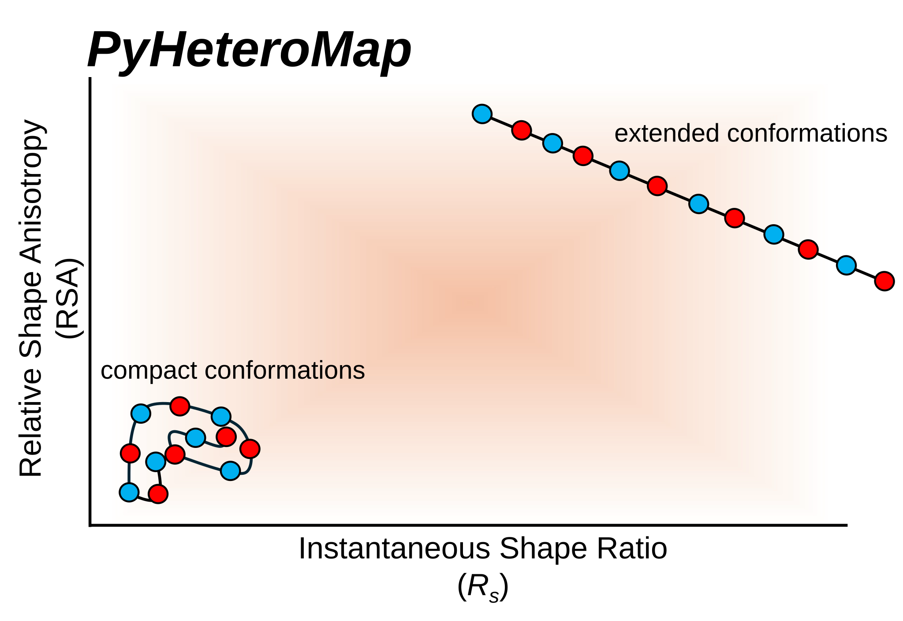

<p align="center">
  
</p>

# **_PyHeteroMap_:** A Companion Package for Resolving Local and Global Conformational Heterogeneity of the Human Intrinsically Disordered Proteome 

---

## Overview

**_PyHeteroMap_** is companion to a manuscript currently under review for publication.

**_PyHeteroMap_** can help analyze the local and global conformational landscapes of a single polypeptide, polymer, protein, or macromolecule, directly from its trajectory. It uses two main metrics of shape:  instantaneous shape ratio (_R<sub>s</sub>_) and relative shape anisotropy (RSA). These shape parameters have previously been defined in this publication: [Biophysical Journal (2024)](https://www.cell.com/biophysj/fulltext/S0006-3495(24)00272-8). **_PyHeteroMap_** generates a scatter plot of _R<sub>s</sub>_ against RSA as a simple map of the conformational landscape of a polymer or protein. [Tesei et al. (2024), *Nature*](https://www.nature.com/articles/s41586-023-07004-5) recenly published simulations of all Intrinsically Disordered Regions (IDRs) in the human proteome - an expansive dataset of 28,058 IDRs. We use these IDRs as a test use case for **_PyHeteroMap_**.

For a given intrinsically disordered protein (IDP) or region (IDR) of a protein:

- **Global conformational ensembles:** can be examined by generating a scatter plot of (instantaneous) _R<sub>s</sub>_ against RSA of the full chain.  
- **Local conformational ensembles:** can be examined by using a moving/sliding window across the chain and monitoring ⟨_R<sub>s</sub>_⟩, ⟨RSA⟩ and other polymer properties of each subchain. Local ensembles can also be examined by generating a scatter plot of (instantaneous) _R<sub>s</sub>_ against RSA of one or more subchain trajectories. 

The Gaussian Walk (GW) polymer model, which is not restricted by excluded volume or other types of interactions, can provide a reference ensemble for the conformational ensembles of other proteins and polymers, as was previously demonstrated ([Biophysical Journal (2024)](https://www.cell.com/biophysj/fulltext/S0006-3495(24)00272-8)).

---

## Features

For a given IDR trajectory, **_PyHeteroMap_** can generate:

1. **Global (RSA, _R<sub>s</sub>_) scatter plots**  
   - Compare an IDR/peptide conformational landscape against that of a Gaussian Walk (GW) reference.  
   - Compute metrics such as the f<sub>C_shape</sub> score that quantify its conformational diversity.
   - Compute ν (the Flory scaling exponent) ([Tesei et al. (2024), *Nature*](https://www.nature.com/articles/s41586-023-07004-5)).


2. **Local polymer property plots**  
   - Display how polymer properties such as ⟨RSA⟩, ⟨Rₛ⟩, and others vary at the subchain level.

3. **Local (RSA, _R<sub>s</sub>_) plots**  
   - For one or more selected subchains of an IDR, (RSA, _R<sub>s</sub>_) scatter plots can be generated (see examples).

**_PyHeteroMap_** can additionally simulate new Gaussian Walk (GW) chains of any chain length and any number of snapshots.

(RSA, _R<sub>s</sub>_) scatter plots can be generated directly from a csv file containing (RSA, _R<sub>s</sub>_) data (no trajectory needed) (see examples).  

---

## Applications

**_PyHeteroMap_** mainly targets the ~28,000 human IDR simulations published by  
[Tesei et al. (2024), *Nature*](https://www.nature.com/articles/s41586-023-07004-5)

- Two such human IDR simulations are included as examples in the `examples/` folder.
- Each IDR has a unique identifier or seq_name.
- (RSA, _R<sub>s</sub>_) plots can be generated without needing a trajectory, if a csv file containing (RSA, _R<sub>s</sub>_) data is provided (see examples).
- Should work for other types of trajectories as well.
- Trajectory analysis is performed using MDTraj.  
- **_PyHeteroMap_** can also simulate new Gaussian Walk (GW) chains of any chain length and number of snapshots.


---

## Included Data

- **Tesei_2024_IDR-ome_fasta_sequences.csv**  
  Provides fasta sequences for all human IDRs published by Tesei et al. (2024).

- **reference_GW_chainlength_100.csv**  
  Gaussian Walk (GW) reference ensemble used in the examples.  
  Located at:  src/pyheteromap/reference_GW_chainlength_100.csv


---

## Quickstart

Clone and install locally:
```
git clone https://github.com/hshadman/IDP_Global_Local_Conformational_Landscapes.git
cd IDP_Global_Local_Conformational_Landscapes
python -m pip install -e . 
```

Example usage inside Python or Jupyter is shown in the examples folder.

NOTE: If the afrc setup fails, please double-check the afrc documentation [here](https://afrc.readthedocs.io/en/latest/overview.html) and [here](https://github.com/idptools/afrc). The version of afrc used in **_PyHeteroMap_** works with Python 3.9.18, but does not work with Python >= 3.12. All dependencies are listed in pyproject.toml.

Example usage in an interface without graphical display (headless) is shown below:

```

import matplotlib
matplotlib.use("Agg") 

import matplotlib.pyplot as plt
import os, pyheteromap
from pyheteromap import PyHeteroMap

FASTA_CSV = os.path.join(os.path.dirname(pyheteromap.__file__), "Tesei_2024_IDR-ome_fasta_sequences.csv")

h = PyHeteroMap("IDR_Example")
h.set_trajectory("traj1.xtc", "top1.pdb")
h.initialize_30mer_subchain(FASTA_CSV)


h.plot_subchain_RSA(6, 4); plt.savefig("subchain_RSA.png", dpi=300, bbox_inches="tight"); plt.close()
h.plot_subchain_Rg(6, 4);  plt.savefig("subchain_Rg.png",  dpi=300, bbox_inches="tight"); plt.close()
h.mod_RSA_Rs_compute_3dplot_from_seq_name("magenta")
plt.savefig("RSA_Rs_vs_GW.png", dpi=300, bbox_inches="tight"); plt.close()
```

---

## Contact

Please feel free to email me at hossain.shadman17@gmail.com.

---

## References

- [Biophysical Journal (2024)](https://www.cell.com/biophysj/fulltext/S0006-3495(24)00272-8)  
- [Tesei et al. (2024), *Nature*](https://www.nature.com/articles/s41586-023-07004-5)


